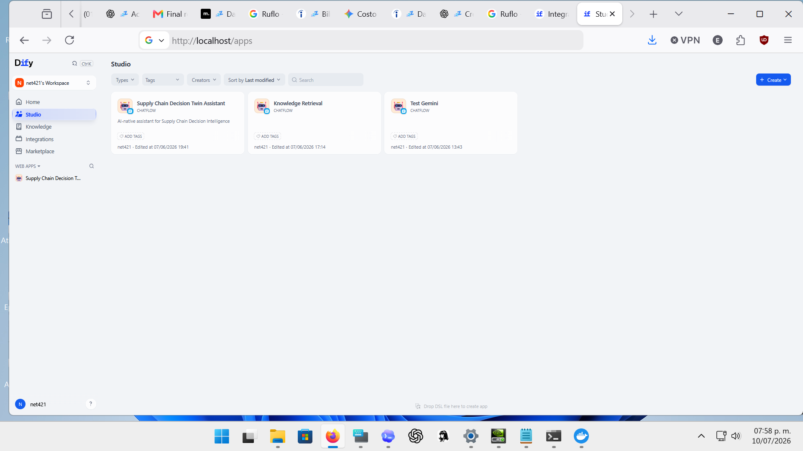
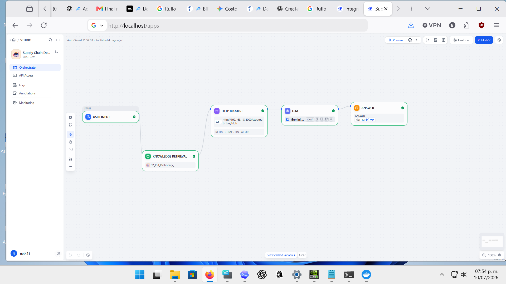

# Supply Chain Decision Twin: Dify + API + RAG + SQL Demo

This repository is a portfolio demo showing how a Dify chatflow can orchestrate
RAG, a deterministic backend API, SQL analytics, decision memory, and an LLM
response for a supply-chain decision-support use case.

The main focus is the integration pattern:

```text
Dify Chatflow
  -> Knowledge Retrieval for governance and semantic context
  -> HTTP/API call to a local FastAPI backend
  -> SQLite SQL query for exact stockout-risk values
  -> LLM response grounded in API output
  -> Human approval boundary
```

This is a synthetic/local decision-support lab. It is not a production
autonomous AI system, and it does not execute purchase orders.

## Demo Evidence

### Dify Studio Apps



The local Dify workspace includes the main chatflow app:
`Supply Chain Decision Twin Assistant`.

### Dify Chatflow Orchestration



The configured chatflow demonstrates:

- `User Input`
- `Knowledge Retrieval`
- `HTTP Request` to the deterministic SQL backend
- `LLM`
- `Answer`

The important design choice is that RAG does not calculate numeric KPI values.
RAG supplies context and governance. The backend API supplies exact SQL-backed
values.

See the full walkthrough in
[docs/PORTFOLIO_DEMO.md](docs/PORTFOLIO_DEMO.md).

## What This Repo Demonstrates

- Dify chatflow orchestration for a realistic AI workflow.
- RAG used for documentation, glossary, semantic contract, limitations, and
  human approval rules.
- A FastAPI backend that exposes deterministic SQL results to Dify.
- SQLite-backed stockout-risk data and decision-memory records.
- Clear separation between LLM wording and backend-calculated facts.
- Tests that validate the API and existing decision-support logic.
- Screenshots and setup notes that prove how the local Dify workflow was
  configured.

## Architecture

```text
User question
  |
  v
Dify Chatflow
  |
  +--> Knowledge Retrieval
  |      - semantic contract
  |      - KPI dictionary
  |      - limitations
  |      - claim boundaries
  |      - human approval rules
  |
  +--> HTTP Request / API Tool
         |
         v
      FastAPI backend
         |
         v
      SQLite: data/supply_chain.db
         |
         v
      Deterministic JSON result
         |
         v
LLM final answer
  |
  v
Human-reviewed decision-support recommendation
```

## Responsibility Split

RAG is used for:

- project documentation,
- semantic contract,
- glossary,
- limitations,
- claim boundaries,
- human approval rules.

SQL/API is used for:

- exact KPI values,
- deterministic thresholds,
- stockout risk rows,
- inventory gap,
- supplier risk,
- recommended action,
- decision memory.

The LLM is used for:

- final explanation,
- summarization,
- decision-support wording,
- human approval framing.

## Key API Endpoints

The local backend lives in `src/api.py`.

```text
GET  /health
GET  /stockout-risks/high
GET  /stockout-risks?threshold=0.70
GET  /decision-memory
POST /decision-memory
GET  /openapi.json
```

Example deterministic response from `GET /stockout-risks/high`:

```json
[
  {
    "product_id": "P001",
    "location_id": "L002",
    "stockout_risk": 0.92,
    "inventory_gap": -30,
    "supplier_risk": 0.72,
    "recommended_action": "Expedite replenishment",
    "requires_human_approval": true
  },
  {
    "product_id": "P002",
    "location_id": "L002",
    "stockout_risk": 0.81,
    "inventory_gap": -10,
    "supplier_risk": 0.76,
    "recommended_action": "Review supplier capacity",
    "requires_human_approval": true
  }
]
```

## Run the Backend API

Windows PowerShell:

```powershell
python -m venv .venv
.\.venv\Scripts\Activate.ps1
python -m pip install -r requirements.txt
python src/create_database.py
python -m uvicorn src.api:app --reload --host 0.0.0.0 --port 8000
```

Useful URLs:

```text
http://localhost:8000/health
http://localhost:8000/stockout-risks/high
http://localhost:8000/openapi.json
```

## Connect Dify to the API

Dify was run locally with Docker from the official open-source project. The
related fork used for reference is:

```text
https://github.com/net421/dify
```

When Dify runs in Docker, use the host address:

```text
http://host.docker.internal:8000/openapi.json
```

For a direct HTTP Request node, call:

```text
http://host.docker.internal:8000/stockout-risks/high
```

Recommended Dify flow:

```text
User Input
  -> Knowledge Retrieval
  -> HTTP Request: GET /stockout-risks/high
  -> LLM
  -> Answer
```

## Demo Question

```text
Which product-location pairs have high stockout risk, and what actions are recommended?
```

The final answer should include:

- `P001-L002`
  - `stockout_risk`: `0.92`
  - `inventory_gap`: `-30`
  - `supplier_risk`: `0.72`
  - `recommended_action`: `Expedite replenishment`
  - `requires_human_approval`: `true`

- `P002-L002`
  - `stockout_risk`: `0.81`
  - `inventory_gap`: `-10`
  - `supplier_risk`: `0.76`
  - `recommended_action`: `Review supplier capacity`
  - `requires_human_approval`: `true`

The final answer should also state that this is a synthetic/local
decision-support lab, the system does not execute purchase orders, and human
approval is required before operational action.

## Run Tests

```powershell
.\.venv\Scripts\Activate.ps1
python -m pytest
```

Current verification:

```text
11 passed
```

## Repository Map

```text
src/api.py                  FastAPI backend for Dify
src/create_database.py      Rebuilds the local SQLite demo database
src/query_stockout_risk.py  SQL-backed stockout-risk demo script
src/write_memory.py         Decision-memory writer
tests/test_api.py           API tests
dify/                       Dify prompts, policies, workflow notes
docs/PORTFOLIO_DEMO.md      Screenshot-based demo walkthrough
docs/screenshots/           Dify configuration screenshots
sql/                        SQLite schema, seed data, and queries
memory/                     Decision-memory schema and examples
```

## More Setup Notes

See:

- [docs/PORTFOLIO_DEMO.md](docs/PORTFOLIO_DEMO.md)
- [docs/dify_api_tool_setup.md](docs/dify_api_tool_setup.md)
- [dify/workflow_design.md](dify/workflow_design.md)
- [dify/system_prompt.md](dify/system_prompt.md)
- [dify/sql_tool_policy.md](dify/sql_tool_policy.md)
- [dify/memory_tool_policy.md](dify/memory_tool_policy.md)

## Claim Boundary

This project demonstrates a synthetic/local decision-support workflow.

It does not demonstrate:

- production deployment,
- autonomous purchasing,
- real supplier recommendations,
- guaranteed business impact,
- enterprise implementation.
